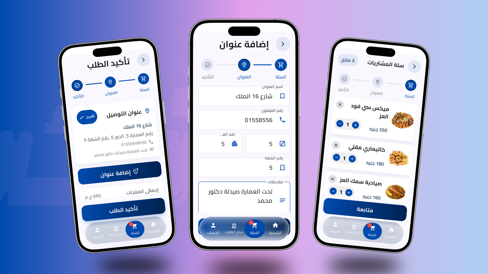
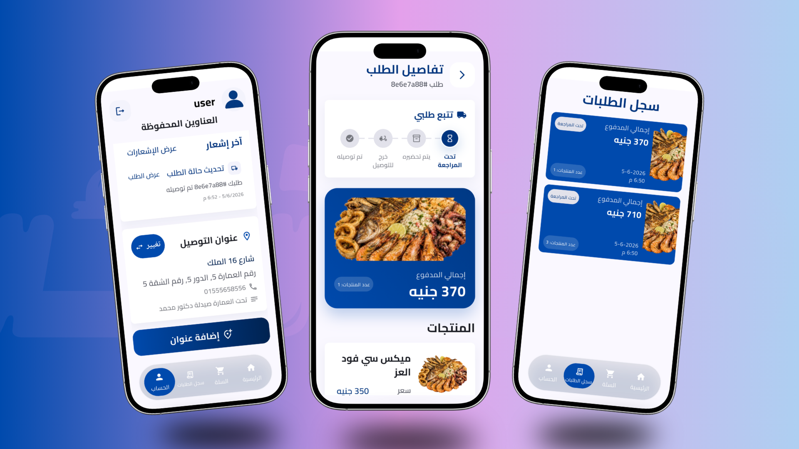

# Makanak / مكانك


<br>

<div align="center">

<p>
   <h3>📲 Download Makanak App</h3>
</p>

<br>

<a href="https://play.google.com/store/apps/details?id=com.makanak.app">
  
</a>

<br>
<br>

<a href="https://drive.google.com/file/d/1Rc4kg5oJRmWpekWXTe_HbllTRWd3ZuhS/view?usp=drive_link">
  
</a>

</div>


---

## Table of Contents

- [Platform Overview](#platform-overview)
- [About This Repository](#about-this-repository)
- [Other Apps in the Platform](#other-apps-in-the-platform)
- [Project Screenshots](#project-screenshots)
- [Platform Diagram](#platform-diagram)
- [Role of This App in the Platform](#role-of-this-app-in-the-platform)
- [Main Features](#main-features)
- [Tech Stack](#tech-stack)
- [Key Flutter Packages](#key-flutter-packages)
- [Architecture Overview](#architecture-overview)
- [Code Structure Diagram](#code-structure-diagram)
- [Supabase Integration](#supabase-integration)
- [Environment Configuration](#environment-configuration)
- [Privacy & Data](#privacy--data)
- [Installation & Setup](#installation--setup)
- [Run Commands](#run-commands)
- [Build Commands](#build-commands)
- [Maintainer](#maintainer)
- [License](#license)

---

## Platform Overview

**Makanak / مكانك** is a complete Flutter + Supabase ecosystem for ordering from nearby shops and restaurants.

The platform is divided into three connected applications:

| App | Target User | Main Role |
|---|---|---|
| `makanak` | Customers | Browse shops, view products, manage cart, place orders, track orders, manage addresses, and receive notifications. |
| `makanak_vendors` | Vendors / Shops / Restaurants | Receive orders, manage order status, manage products, update shop availability, and handle vendor-side operations. |
| `makanak_admin` | Platform Admins | Create vendor accounts, manage shops, toggle maintenance mode, activate/deactivate vendors, and control platform settings. |

All applications are connected through one shared Supabase backend.

---

## About This Repository

This repository contains the **Customer App** of the Makanak ecosystem.

The customer app is the public-facing mobile application used by customers to:

- Browse active and visible shops.
- View shop products.
- Add products to cart.
- Manage delivery addresses.
- Place orders.
- Track previous orders.
- Receive push notifications.
- Open supported deep links.

This app is Arabic-first and designed for a simple, modern customer experience.

---

## Other Apps in the Platform

### Vendor App — `makanak_vendors`

The Vendor App is used by shops and restaurants.  
Vendors log in using accounts created by the admin app, then manage their own operations.

Main responsibilities:

- Vendor authentication.
- Load the vendor’s assigned shop.
- View incoming orders.
- Update order status.
- Manage products.
- Update shop settings.
- Handle shop availability.
- Receive realtime/order notifications.

Repository:

```text
https://github.com/MOMEN56/makanak_vendors
```

### Admin App — `makanak_admin`

The Admin App is used only by platform administrators.

Main responsibilities:

- Admin login.
- Create vendor accounts.
- Add vendor/shop details.
- Toggle global customer maintenance mode.
- Activate/deactivate shops.
- Manage platform-level settings.
- Send manual notifications where implemented.

Repository:

```text
https://github.com/MOMEN56/makanak_admin
```

---

## Project Screenshots

<table>
  <tr>
    <td width="50%">
      
    </td>
    <td width="50%">
      
    </td>
  </tr>
  <tr>
    <td width="50%">
      
    </td>
    <td width="50%">
      
    </td>
  </tr>
  <tr>
    <td width="50%">
      
    </td>
    <td width="50%">
      
    </td>
  </tr>
</table>

## Platform Diagram

```text
                    ┌──────────────────────┐
                    │   makanak_admin       │
                    │   Admin App           │
                    └──────────┬───────────┘
                               │
                               │ Manage shops, vendors,
                               │ maintenance, settings
                               │
┌──────────────────────┐       ▼        ┌──────────────────────┐
│   makanak            │  Supabase       │   makanak_vendors    │
│   Customer App       │◄──────────────►│   Vendor App         │
└──────────────────────┘                └──────────────────────┘
        │                                         │
        │ Place orders                            │ Manage orders
        │ Manage addresses                        │ Manage products
        │ Receive notifications                    │ Update shop status
        ▼                                         ▼

              Shared Supabase Backend
              - Authentication
              - Database
              - Storage where used
              - Realtime where used
              - Edge Functions where used
```

---

## Role of This App in the Platform

The Customer App is responsible for the customer journey.

It reads data prepared and controlled by the admin/vendor apps:

- Shops are created and managed by admin/vendor flows.
- Products are managed by vendors.
- Orders are created by customers and handled by vendors.
- Maintenance mode can be controlled by the admin app.
- Notifications connect customer/vendor/admin flows.

The customer app should only show shops and products that are valid for customers, such as active/visible shops and visible/in-stock products where implemented.

---

## Main Features

The customer app includes:

### Customer Experience

- Customer authentication.
- Browse shops.
- Search shops.
- Browse products.
- Search products.
- Cart management.
- Address management.
- Arabic-first UI.
- Responsive UI helpers.

### Orders

- Place order.
- Order history.
- Order details.

### Notifications & Navigation

- Push notifications.
- Local notifications.
- Deep link handling.

### App Infrastructure

- Supabase initialization.
- App remote config / maintenance gate.
- Reusable widgets.
- Shared error/loading/empty states.
- Android release configuration.
- Google Play preparation context.

---

## Tech Stack

- Flutter
- Dart
- Supabase Flutter
- Supabase Authentication
- Supabase Database
- Supabase RPC
- Firebase Messaging
- Flutter Local Notifications
- Flutter Bloc / Cubit
- GetIt dependency injection
- Repository pattern where implemented
- Cached Network Image
- Shared Preferences
- App Links
- URL Launcher
- Flutter Native Splash
- Flutter Launcher Icons
- Cairo font

---
## Flutter App Packages

| Package | Version | Usage |
|---|---|---|
| `supabase_flutter` | `^2.10.6` | Supabase initialization, authentication, database access, RPC calls, and backend integration. |
| `firebase_core` | `^4.1.1` | Firebase initialization required for Firebase services. |
| `firebase_messaging` | `^16.0.1` | Push notifications using Firebase Cloud Messaging. |
| `flutter_local_notifications` | `^19.5.0` | Display local notifications inside the app. |
| `flutter_bloc` | `^9.1.1` | State management using Cubit/Bloc. |
| `get_it` | `^8.0.3` | Dependency injection and service locator setup. |
| `google_sign_in` | `^6.3.0` | Google sign-in authentication flow. |
| `cached_network_image` | `^3.4.1` | Load and cache remote images with placeholders. |
| `shared_preferences` | `^2.5.3` | Store lightweight local app preferences. |
| `app_links` | `^6.4.1` | Handle supported app links and deep links. |
| `url_launcher` | `^6.3.2` | Open external links and supported URL actions. |
| `shimmer` | `^3.0.0` | Display loading skeleton/shimmer effects. |
| `package_info_plus` | `^8.3.1` | Read app package information such as version/build number. |
| `flutter_native_splash` | `^2.4.6` | Configure native splash screen. |
| `flutter_launcher_icons` | `^0.14.4` | Generate Android/iOS launcher icons. |

---
## Architecture Overview

The app follows a feature-based architecture.

High-level layers:

- `core/`  
  Shared infrastructure such as routing, services, utilities, data sources, deep links, Supabase client setup, and global helpers.

- `features/`  
  Main business features such as authentication, shops, products, cart, addresses, orders, notifications, profile, and remote config.

- `shared/`  
  Reusable widgets and views used across multiple features.

- `main.dart`  
  Application entry point.

- `makanak_app.dart`  
  Root app widget and global configuration.

---

## Code Structure Diagram

```text
lib/
├── main.dart
├── makanak_app.dart
│
├── core/
│   ├── data/
│   │   ├── data_sources/
│   │   │   ├── address_local_data_source.dart
│   │   │   └── address_remote_data_source.dart
│   │   │
│   │   └── repos/
│   │       └── address_repository_impl.dart
│   │
│   ├── deep_linking/
│   │   ├── app_deep_link.dart
│   │   ├── deep_link_navigator.dart
│   │   └── deep_link_parser.dart
│   │
│   ├── domain/
│   │   └── repos/
│   │       └── address_repository.dart
│   │
│   ├── errors/
│   │   ├── database_exception.dart
│   │   ├── failure_mapper.dart
│   │   └── failures.dart
│   │
│   ├── helper/
│   │   ├── order_date_formatter.dart
│   │   └── print_helper.dart
│   │
│   ├── models/
│   │   ├── address_form_draft_model.dart
│   │   └── user_address_model.dart
│   │
│   ├── presentation/
│   │   └── manager/
│   │       └── address_cubit/
│   │           ├── address_cubit.dart
│   │           └── address_state.dart
│   │
│   ├── routing/
│   │   ├── app_route_arguments.dart
│   │   ├── app_router.dart
│   │   └── route_error_view.dart
│   │
│   ├── services/
│   │   ├── google_sign_in_service.dart
│   │   ├── service_locator.dart
│   │   ├── services.dart
│   │   ├── supabase_auth_service.dart
│   │   ├── supabase_client_service.dart
│   │   ├── supabase_remote_data_source.dart
│   │   │
│   │   └── notification_service/
│   │       ├── notification_event.dart
│   │       ├── notification_navigation_service.dart
│   │       ├── notification_navigator.dart
│   │       ├── push_notification_service.dart
│   │       └── push_token_manager.dart
│   │
│   └── utils/
│       ├── address_form_controller.dart
│       ├── address_form_validator.dart
│       ├── app_empty_state_strings.dart
│       ├── app_responsive.dart
│       ├── app_spacing.dart
│       ├── app_strings.dart
│       ├── app_text_styles.dart
│       ├── assets.dart
│       ├── bootstrap_error_logging.dart
│       ├── endpoints.dart
│       ├── order_status_presenter.dart
│       │
│       └── bloc/
│           └── safe_emit_mixin.dart
│
├── features/
│   ├── app_remote_config/
│   │   ├── data/
│   │   │   ├── data_sources/
│   │   │   │   ├── app_remote_config_local_data_source.dart
│   │   │   │   └── app_remote_config_remote_data_source.dart
│   │   │   │
│   │   │   └── repos/
│   │   │       └── app_remote_config_repo_impl.dart
│   │   │
│   │   ├── domain/
│   │   │   ├── entities/
│   │   │   │   └── app_access_result.dart
│   │   │   │
│   │   │   └── repos/
│   │   │       └── app_remote_config_repo.dart
│   │   │
│   │   └── presentation/
│   │       ├── manager/
│   │       │   └── app_remote_config_cubit/
│   │       │       ├── app_remote_config_cubit.dart
│   │       │       └── app_remote_config_state.dart
│   │       │
│   │       └── views/
│   │           ├── app_remote_config_gate_view.dart
│   │           │
│   │           └── widgets/
│   │               ├── app_remote_config_blocking_widget.dart
│   │               ├── app_remote_config_gate_view_body.dart
│   │               └── app_remote_config_loading_view_body.dart
│   │
│   ├── auth/
│   │   ├── data/
│   │   │   ├── data_sources/
│   │   │   │   └── profile_remote_data_source.dart
│   │   │   │
│   │   │   ├── models/
│   │   │   │   └── profile_model.dart
│   │   │   │
│   │   │   ├── repos/
│   │   │   │   └── auth_repo_impl.dart
│   │   │   │
│   │   │   └── utils/
│   │   │       ├── auth_error_mapper.dart
│   │   │       └── auth_logger.dart
│   │   │
│   │   ├── domain/
│   │   │   ├── entities/
│   │   │   │   └── profile_entity.dart
│   │   │   │
│   │   │   └── repos/
│   │   │       └── auth_repo.dart
│   │   │
│   │   └── presentation/
│   │       ├── manager/
│   │       │   └── auth_cubit/
│   │       │       ├── auth_cubit.dart
│   │       │       └── auth_state.dart
│   │       │
│   │       └── views/
│   │           ├── auth_gate_view.dart
│   │           ├── sign_in_view.dart
│   │           ├── sign_up_view.dart
│   │           │
│   │           └── widgets/
│   │               ├── auth_form_state_builder.dart
│   │               ├── auth_form_validators.dart
│   │               ├── auth_gate_view_body.dart
│   │               ├── auth_google_button.dart
│   │               ├── auth_logo_badge.dart
│   │               ├── auth_message_view.dart
│   │               ├── auth_primary_button.dart
│   │               ├── auth_scaffold.dart
│   │               ├── auth_status_card.dart
│   │               ├── auth_text_form_field.dart
│   │               ├── sign_in_view_body.dart
│   │               ├── sign_up_form_fields.dart
│   │               └── sign_up_view_body.dart
│   │
│   ├── bottom_navigation/
│   │   └── presentation/
│   │       └── views/
│   │           └── widgets/
│   │               ├── bottom_navigation_item.dart
│   │               ├── cart_navigation_tab.dart
│   │               └── liquid_glass_bottom_navigation.dart
│   │
│   ├── cart/
│   │   ├── data/
│   │   │   ├── models/
│   │   │   │   └── cart_view_arguments.dart
│   │   │   │
│   │   │   ├── repos/
│   │   │   │   └── cart_repository_impl.dart
│   │   │   │
│   │   │   └── services/
│   │   │       └── cart_local_storage.dart
│   │   │
│   │   ├── domain/
│   │   │   └── repos/
│   │   │       └── cart_repository.dart
│   │   │
│   │   ├── presentation/
│   │   │   ├── actions/
│   │   │   │   └── cart_route_arguments_builder.dart
│   │   │   │
│   │   │   ├── manager/
│   │   │   │   ├── cart_cubit/
│   │   │   │   │   ├── cart_cubit.dart
│   │   │   │   │   ├── cart_cubit_registry.dart
│   │   │   │   │   └── cart_state.dart
│   │   │   │   │
│   │   │   │   └── checkout_cubit/
│   │   │   │       ├── checkout_cubit.dart
│   │   │   │       └── checkout_state.dart
│   │   │   │
│   │   │   └── views/
│   │   │       ├── add_user_address_view.dart
│   │   │       ├── cart_view.dart
│   │   │       ├── confirming_order_view.dart
│   │   │       ├── submit_order_view.dart
│   │   │       │
│   │   │       └── widgets/
│   │   │           ├── add_user_address_view_body.dart
│   │   │           ├── cart_header_widget.dart
│   │   │           ├── cart_item_card.dart
│   │   │           ├── cart_skeleton.dart
│   │   │           ├── cart_step_header_widget.dart
│   │   │           ├── cart_step_indicator.dart
│   │   │           ├── cart_view_body.dart
│   │   │           ├── confirming_order_content.dart
│   │   │           ├── confirming_order_row_widget.dart
│   │   │           ├── confirming_order_view_body.dart
│   │   │           ├── selectable_address_card_widget.dart
│   │   │           └── submit_order_view_body.dart
│   │   │
│   │   └── services/
│   │       └── cart_availability_service.dart
│   │
│   ├── notifications/
│   │   └── data/
│   │       ├── data_sources/
│   │       │   └── push_token_remote_data_source.dart
│   │       │
│   │       └── repos/
│   │           └── notifications_repository_impl.dart
│   │
│   ├── order_history/
│   │   ├── data/
│   │   │   ├── data_sources/
│   │   │   │   └── orders_remote_data_source.dart
│   │   │   │
│   │   │   ├── models/
│   │   │   │   └── order_model.dart
│   │   │   │
│   │   │   └── repos/
│   │   │       └── order_history_repository_impl.dart
│   │   │
│   │   ├── domain/
│   │   │   └── repos/
│   │   │       └── order_history_repository.dart
│   │   │
│   │   └── presentation/
│   │       ├── manager/
│   │       │   ├── order_details_cubit/
│   │       │   │   ├── order_details_cubit.dart
│   │       │   │   └── order_details_state.dart
│   │       │   │
│   │       │   └── order_history_cubit/
│   │       │       ├── order_history_cubit.dart
│   │       │       └── order_history_state.dart
│   │       │
│   │       └── views/
│   │           ├── order_details_view.dart
│   │           ├── order_history_view.dart
│   │           │
│   │           └── widgets/
│   │               ├── order_delivery_status_cancelled_section.dart
│   │               ├── order_delivery_status_stepper.dart
│   │               ├── order_details_header.dart
│   │               ├── order_details_info_card.dart
│   │               ├── order_details_product_card.dart
│   │               ├── order_details_view_body.dart
│   │               ├── order_hero_card.dart
│   │               ├── order_history_card.dart
│   │               ├── order_history_skeleton.dart
│   │               └── order_history_view_body.dart
│   │
│   ├── profile/
│   │   └── presentation/
│   │       └── views/
│   │           ├── profile_view.dart
│   │           │
│   │           └── widgets/
│   │               ├── empty_addresses.dart
│   │               ├── profile_actions_sheet.dart
│   │               ├── profile_addresses_section.dart
│   │               ├── profile_addresses_skeleton.dart
│   │               ├── profile_avatar.dart
│   │               ├── profile_header.dart
│   │               ├── profile_header_section.dart
│   │               └── profile_view_body.dart
│   │
│   ├── shop/
│   │   ├── data/
│   │   │   ├── data_sources/
│   │   │   │   └── products_remote_data_source.dart
│   │   │   │
│   │   │   └── repos/
│   │   │       ├── products_repo.dart
│   │   │       └── products_repo_impl.dart
│   │   │
│   │   ├── domain/
│   │   │   └── entities/
│   │   │       ├── product_availability_extension.dart
│   │   │       └── product_entity.dart
│   │   │
│   │   └── presentation/
│   │       ├── actions/
│   │       │   └── add_product_to_cart_action.dart
│   │       │
│   │       ├── manager/
│   │       │   └── products_cubit/
│   │       │       ├── products_cubit.dart
│   │       │       └── products_state.dart
│   │       │
│   │       └── views/
│   │           ├── product_details_view.dart
│   │           ├── products_view.dart
│   │           ├── shop_navigation_view.dart
│   │           │
│   │           └── widgets/
│   │               ├── add_button.dart
│   │               ├── product_card_action_switcher.dart
│   │               ├── product_details_image.dart
│   │               ├── product_details_view_body.dart
│   │               ├── products_list.dart
│   │               ├── products_view_body.dart
│   │               └── show_product_added_snack_bar.dart
│   │
│   └── shops/
│       ├── data/
│       │   ├── data_sources/
│       │   │   └── shops_remote_data_source.dart
│       │   │
│       │   ├── models/
│       │   │   └── shop_model.dart
│       │   │
│       │   └── repos/
│       │       ├── shops_repo.dart
│       │       └── shops_repo_impl.dart
│       │
│       ├── domain/
│       │   └── entities/
│       │       └── shop_entity.dart
│       │
│       └── presentation/
│           ├── manager/
│           │   └── shops_cubit/
│           │       ├── shops_cubit.dart
│           │       └── shops_state.dart
│           │
│           └── views/
│               ├── shops_view.dart
│               │
│               └── widgets/
│                   ├── shop_card.dart
│                   ├── shop_view_body.dart
│                   ├── shops_header.dart
│                   ├── shops_list.dart
│                   └── shops_skeleton.dart
│
└── shared/
    ├── views/
    │   └── No shared views documented yet
    │
    └── widgets/
        ├── add_address_button.dart
        ├── add_address_view_body.dart
        ├── address_card_widget.dart
        ├── address_details_fields_widget.dart
        ├── address_form_fields.dart
        ├── address_selector_sheet_widget.dart
        ├── app_snack_bar.dart
        ├── app_system_ui_wrapper.dart
        ├── confirming_card_widget.dart
        ├── custom_button.dart
        ├── custom_loading_indicator.dart
        ├── message_emoji_widget.dart
        ├── network_image_with_placeholder.dart
        ├── order_summary_card_widget.dart
        ├── quantity_selector.dart
        ├── release_error_view_body.dart
        ├── search_text_field.dart
        ├── user_address__text_field_widget.dart
        │
        ├── shimmer/
        │   ├── app_shimmer.dart
        │   └── shimmer_circle.dart
        │
        └── skeletons/
            ├── address_card_skeleton.dart
            ├── cart_item_card_skeleton.dart
            ├── order_history_card_skeleton.dart
            └── shop_card_skeleton.dart
```

## Supabase Integration

The customer app uses Supabase as the main backend.

The customer app uses Supabase for:

- Authentication.
- Database queries.
- RPC functions.
- Remote configuration.
- Orders.
- Addresses.
- Shops.
- Products.
- Push token persistence where implemented.

Known tables / objects from project context:

| Name | Type | Usage |
|---|---|---|
| `shops` | Table | Customer shop listing |
| `products` | Table | Product listing |
| `orders` | Table | Customer order history/details |
| `user_addresses` | Table | Customer delivery addresses |
| `app_remote_config` | Table | Maintenance/access gate |
| `create_order` | RPC | Create customer order |
| `add_user_address` | RPC | Add customer address |
| `fetch_user_addresses` | RPC | Fetch customer addresses |
| `set_default_user_address` | RPC | Set default address |

---

## Environment Configuration

Use safe configuration for Supabase/Firebase values.  
Do not hardcode production secrets directly in the repository.

Recommended:

- Keep public client configuration separate from source code when possible.
- Do not commit private keys.
- Do not commit release signing passwords.
- Keep development and production configuration separated.

---

## Privacy & Data

The customer app may handle user-related data such as:

- Account information.
- Delivery addresses.
- Orders.
- Push notification tokens.

Privacy policy and data deletion links should be configured in the Google Play Console and kept updated for production releases.

---

## Installation & Setup

```bash
git clone https://github.com/MOMEN56/makanak.git
cd makanak
flutter pub get
flutter run
```

---

## Run Commands

```bash
flutter pub get
flutter analyze
flutter test
flutter run
```

---

## Build Commands

```bash
flutter build apk --debug
flutter build apk --release
flutter build appbundle --release
flutter build ios --release
```

---


## Maintainer

Maintainer: `MOMEN56`  
Contact: 5momenalaa5@gmail.com

---

## License

This project is proprietary software.

Copyright (c) 2026 MOMEN56.  
All rights reserved.

This source code is not licensed for public use, copying, modification, distribution, or commercial reuse without explicit written permission from the owner.
